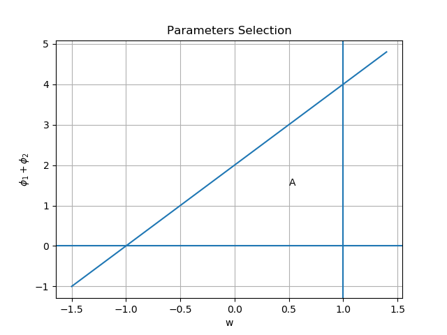
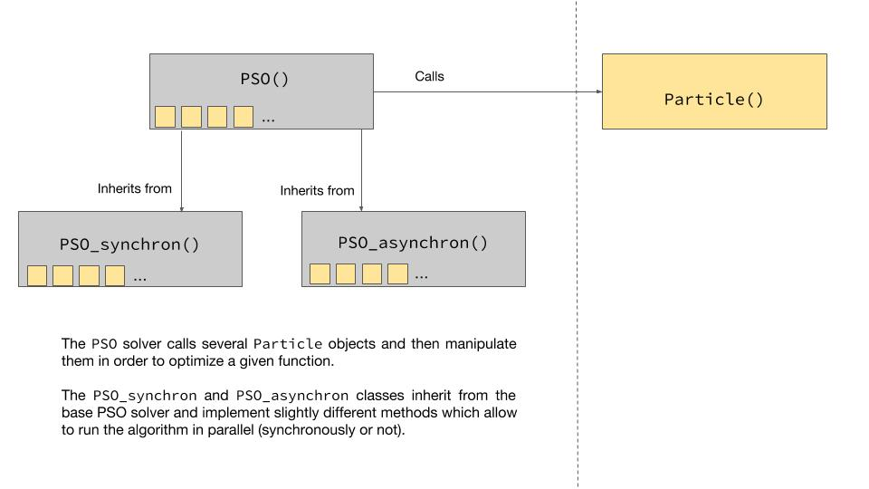

---
title: Particle Swarm Optimisation - Group 3

author:
- 23383
- 10772
- 11053
- 14781

abstract: "Our group project consists of an extensive description, discussion, and implementation
of the Particle Swarm Optimization (PSO) algorithm. After describing the simplest
version of the algorithm – including the theory behind its convergence and choice of
hyperparameters – and some of its applications, we turn to two parallel variants of
PSO (synchronous and asynchronous). We implement all three versions of the PSO
algorithm in python and test them on six classic optimization functions. While all of
them perform very well on all functions, the parallel implementations typically take
longer to run – most likely due the relatively cheap cost of each PSO iteration and the
overhead introduced by the parallelization of python processes. All code and the report are available on GitHub at https://github.com/vviers/ST444-Group3"

---

\newpage

# Particle Swarm Algorithm

## Background and Algorithm

The particle swarm optimization (PSO) algorithm was first developed by James Kennedy and Russell Eberhart in 1995, who were inspired by the movement of schools of fish and flocks of birds. Computer simulations of the flocking behavior of animals are common in the field of artificial life and are often used for computer animations. Kennedy and Russell observed that in a group, these animals were able to utilize both their own knowledge as well as the group's knowledge in order to navigate. The particle swarm optimization method uses this idea by iteratively moving particles across the search space toward a weighted average of their own best position and the group's best position [@eberhart1995new]. The algorithm is given below [@poli2007particle]:

__Algorithm 1__

1. Initialize an array of $N$ particles with $d$-dimensional random positions $\{x^i\}_{i=1}^N$ and velocities $\{v^i\}_{i=1}^N$ in the search space, $\mathcal{S} \subseteq \mathbb{R}^d$. ($i$ is particle index here, not an exponent)
2. Repeat until a convergence criterion is met or the maximum number of iterations ($k=1,\ldots,k_{max}$) is reached:
   1. For each particle, evaluate the fitness function (the objective function), $f(x_k^i)$. Compare the current fitness value with the particle's best fitness value found so far, $pbest_{k-1}^i$. If the current value is better, set $pbest_k^i$ equal to the current value and the particle's best position, $p_k^i$ to the current position.
   2. Find the particle with the best fitness value and set the neighbourhood's best fitness value $pbest_k^g$ and best position $p_k^g$ to be the fitness value and position of this particle respectively.
   3. For each particle, update the position and velocity of particle $i$ at iteration $k+1$ according to the equations:
      $$x_{k+1}^i = x_k^i + v^i_{k+1} \tag{1}$$
      $$v_{k+1}^i = w_k\otimes v_k^i + c_1\otimes r_1\otimes (p_k^i-x_k^i)+c_2\otimes r_2\otimes (p_k^g-x_k^i) \tag{2}$$
      where all being $d$-dimensional, $w_k$ is an inerta parameter, $c_1$ is a cognitive parameter, $c_2$ is a social parameter, and $r_1$ and $r_2$ are $d$-dimensional vectors of independent random variables uniformly distributed in $[0,1]$, with $\otimes$ representing element-wise multiplication between vectors.
    

The algorithm starts out with particles moving randomly around the search space, then in each iteration, takes note of each particle's personal best position visited so far and the best position found in the group, updating the each particle's movement according to (i) the particle's previous direction, weighted by $w$, (ii) the direction towards personal best position (self-cognitive behaviour), weighted by $\phi_1=c_1\otimes r_1$, and (iii) the direction towards the group's best position (social behaviour), weighted by $\phi_2=c_2\otimes r_2$. The general role of the model parameters is to create a balance between exploration and exploitation, which determines the algorithm performance.  

"Exploration" refers to the ability of the algorithm to test many different parts of the search space, while "exploitation" is the precision with which the algorithm is able to concentrate around an optimum [@trelea2003particle]. A higher level of exploration means the algorithm is less likely to converge to a local optimum rather than a global one, while a higher level of exploitation means that the algorithm will converge more quickly, but it might be to a local optimum rather than a global one.  

### Modifications and Variants

A few major modifications to PSO are discussed in this section since they give us a better understanding of the design and the parameters used in PSO. The original PSO model does not have the inertia parameter and uses $c_1=c_2=2$, however this causes it to "explode", that is, the particles' trajectories are divergent and many will even move out of the search space. This will be proven in section 1.2. Hence, "velocity clamping" is introduced by setting bounds $[V_{min},V_{max}]$ for particles' velocities. However, this cannot ensure the convergence of PSO.

@shi1998modified modify the PSO by adding the inertia parameter, as a means to balance the exploration and exploitation of the model, and at the same time eliminate the need for velocity clamping. The inertia parameter, $w$, effects how easily the particles will move through the search space. @poli2007particle describe it as the "fluidity of the medium in which a particle moves". $w$ typically takes values between 0 and 1, and when it is close to zero, the exploration of the algorithm will be low. On the other hand, when $w$ is close to 1, exploration will be high, with particles moving through "low viscosity medium" [@poli2007particle]. One strategy that is commonly employed to balance these effects is starting the algorithm with a high inertia coefficient and gradually reducing it toward zero as the iterations progress.

To remove the need for velocity clamping and to guarantee convergence, @clerc2002particle modify the original PSO by adding a constriction coefficient $\chi$ to the velocity update equation as showed below:
$$v_{k+1}^i = \chi\left(v_k^i + c_1\otimes r_1\otimes (p_k^i-x_k^i)+c_2\otimes r_2\otimes (p_k^g-x_k^i)\right)$$
$\chi$ is derived theoretically such that convergence is ensured, however, it is not straightforward to derive from this model a practical guideline for parameters selection [@trelea2003particle].

In addition to these two important modifications, different topologies have been considered [@poli2007particle] and many variants of PSO have been developed for different purposes [@poli2007particle; @cheng2018quarter]. 

In the rest of the report, PSO model with an inertia parameter, as shown in __Algorithm 1__, and with the neighbourhood being the entire swarm (the so-called global best or "gbest" topology) will be used.

## Convergence Analysis

In contrast to the normal modelling problems in which models are designed to fit the observed natural occurrences, we have an exact model of PSO which is complicated, and thus we want to approximate this model with a simplified one on which convergence analysis is viable. There are primarily two approaches: deterministic model (where the stochastic components in PSO are assumed to be fixed) and stochastic model (where the previous assumption is dropped). The focus of this section is on the deterministic model for the PSO in __Algorithm 1__ as it leads us to practical criteria on the model parameters $w$, $c_1$ and $c_2$.

### Deterministic PSO Model

We will first examine the deterministic model presented in the works of @trelea2003particle and @van2006study. Besides the _deterministic assumption_ that $\phi_1$ and $\phi_2$ are fixed, a further assumption, coined as _stagnation assumption_ by @cleghorn2014generalized, that $p_k^i=p^i$ and $p_k^g=p^g$ for all $k$, is made. Note that this assumption still allows different particles to have different personal best positions, but this best position is fixed across iterations. Without loss of generality, the convergence analysis will be concentrated on a one-dimensional particle (so that we can drop the index $i$), and it will be clear that the result applies to every particle and to a higher dimensional case. It will be shown that the particle converges to a stable point, which will be a weighted average of $p^i$ and $p^g$. Note that whether this point is a local or global optimum is not implied from this analysis, and what is crucial here is that each particle will converge to a stable point and the swarm attains equilibrium.

Consider the one-dimensional version of the position and velocity update equations, Eq.(1) and Eq.(2) in __Algorithm 1__, but with $c_1r_1$ and $c_2r_2$ replaced with $\phi_1$ and $\phi_2$, the particle index $i$ dropped, and with $p_k^i$ and $p_k^g$ set to fixed values $p$ and $p^g$:
$$x_{k+1} = x_k + v_{k+1} \tag{3}$$
$$v_{k+1} = w_kv_k + \phi_1(p-x_k)+\phi_2(p^g-x_k) \tag{4}$$

Substituting Eq.(4) into Eq.(3) gives the following recurrence relation between $x_{k+1}$ and its previous two positions $x_k$ and $x_{k-1}$:
$$x_{k+1}=(1+w-\phi_1-\phi_2)x_k - wx_{k-1} + \phi_1p +\phi_2p^g \tag{5}$$

which can be written in the following matrix form:
$$\begin{bmatrix}
x_{k+1} \\
x_k
\end{bmatrix} = A \begin{bmatrix}
x_k \\
x_{k-1}
\end{bmatrix} + b $$
where 
$$A = \begin{bmatrix}
1+w-\phi_1-\phi_2 & -w \\
1 & 0
\end{bmatrix} \quad b = \begin{bmatrix}
\phi_1p + \phi_2p^g \\
0
\end{bmatrix}$$

By solving the characteristic polynomial of matrix $A$:
$$\lambda^2-(1+w-\phi_1-\phi_2)\lambda+w=0$$
the eigenvalues can be obtained in terms of the fixed model parameters:
$$\lambda_1=\frac{(1+w-\phi_1-\phi_2)+\gamma}{2}$$
$$\lambda_2=\frac{(1+w-\phi_1-\phi_2)-\gamma}{2}$$
where $\gamma = \sqrt{(1+w-\phi_1-\phi_2)^2-4w}$, which is complex when $(1+w-\phi_1-\phi_2)^2<4w$.

The explicit closed-form solution of the recurrence Eq.(5), in terms of $x_0$ and $x_1$, is then:
$$x_k = \beta_1+\beta_2\lambda_1^k+\beta_3\lambda_2^k \tag{6}$$
where
$$\begin{aligned}
\beta_1 &= \frac{\phi_1p+\phi_2p^g}{\phi_1+\phi_2}\\
\beta_2 &= \frac{\lambda_2(x_0-x_1)-x_1+x_2}{\gamma(\lambda_1-1)}\\
\beta_3 &= \frac{\lambda_1(x_1-x_0)+x_1-x_2}{\gamma(\lambda_2-1)}\\
x_2 &=(1+w-\phi_1-\phi_2)x_1 - wx_0 + \phi_1p +\phi_2p^g
\end{aligned}$$

For a complex eigenvalue $\lambda$,
$$\lim\limits_{k\to\infty} \lambda^k = \lim\limits_{k\to\infty} ||\lambda||^k e^{i\theta k} = \lim\limits_{k\to\infty} ||\lambda||^k(\cos \theta k+i \sin \theta k)$$
where $\theta=arg(\lambda)$. Hence, $\lim\limits_{k\to\infty} \lambda^k = 0$ if $||\lambda||<1$, and this also holds for real eigenvalue. The explicit solution in Eq.(6) thus implies that if $\max\{||\lambda_1||,||\lambda_2||\}<1$, then
$$\lim\limits_{k\to\infty} x_k = \beta_1 =\frac{\phi_1p+\phi_2p^g}{\phi_1+\phi_2}$$

At this point, we will drop the _deterministic assumption_ and take into account the randomness of $\phi_1$ and $\phi_2$. Since $r_1$ and $r_2$ are uniformly distributed in $[0,1]$, taking expectation of $\beta_1$ gives
$$\begin{aligned}
\mathbb E(\beta_1)&=\frac{\frac{c_1}{2}p+\frac{c_2}{2}p^g}{\frac{c_1}{2}+\frac{c_2}{2}}=\frac{c_1p+c_2p^g}{c_1+c_2}\\
&=\frac{c_1}{c_1+c_2}p+\frac{c_2}{c_1+c_2}p^g = \frac{c_1}{c_1+c_2}p+\left(1-\frac{c_1}{c_1+c_2}\right)p^g \\
&=\alpha p+(1-\alpha) p^g
\end{aligned}$$
where $\alpha = \frac{c_1}{c_1+c_2}\in [0,1]$.

Hence, under the condition that $\max\{||\lambda_1||,||\lambda_2||\}<1$, it has been shown that the particle converges to a stable point which is, on average, the weighted average of its best position and the global best position.

### Generalised Deterministic Model and Stochastic Model

However, the _stagnation assumption_ is unrealistic, at least for two reasons [@cleghorn2014generalized]. First, PSO relies on the social interaction between particles, which becomes meaningless if $p^i$ and $p^g$ are fixed. Second, when PSO is stagnated, then it is no longer an optimiser, as subsequent iterations will not give a better solution. Therefore, @cleghorn2014generalized replace the _stagnation assumption_ with the weaker assumption that $p^i$ and $p^g$ can take an arbitrarily large but finite number of distinct values, and then prove, under the same framework as laid out above, that each particle converges to a point if $\max\{||\lambda_1||,||\lambda_2||\}<1$. This results in a generalised deterministic model, which yields the same result, with the same condition, but with a weaker and more realistic assumption.

In addition, several stochastic models have been formulated to approximate the PSO model (refer to [@cleghorn2014generalized] for a brief coverage of these models). For a more recent work, the swarm state sequence, in which the state of a particle $i$ at iteration $k$ is defined as $(x_{k-1},x_k,p_k^i,p_k^g)$, is modelled as a Markov chain and then the convergence analysis is carried out by utilising supermartingale convergence theorem [@xu2018reprint].

### Parameter Condition for Convergence

The condition of $\max\{||\lambda_1||,||\lambda_2||\}<1$ for the convergence to a stable point implies the following set of conditions on the model parameters which can be employed as a practical guideline for parameters selection:
$$||w||<1 \quad 0<\phi_1+\phi_2<4 \quad w>\frac{\phi_1+\phi_2}{2}-1$$

The intersection area of these constraints is shown as area A in figure 1.

{ width=70% }

Notice that there are still stochastic components $\phi_1$ and $\phi_2$ in the conditions, as these are the general conditions for the generalised deterministic model [@cleghorn2014generalized]. If we replace the random $\phi_1+\phi_2$ with their expected value, which is just $\frac{c_1+c_2}{2}$, then we arrive at the conditions for convergence presented in @trelea2003particle, with $b=\frac{c_1+c_2}{2}$:
$$-1<w<1 \quad b>0 \quad w>\frac{b}{2}-1 \quad (w>\frac{c_1+c_2}{4}-1)$$

Instead of using the expected value, if we replace the randomness with the upper bound of $\phi_1+\phi_2$, which is $c_1+c_2$ since $r_1,r_2 \in [0,1]$, then we obtain the conditions of convergence delineated in @van2006study:
$$0<w<1 \quad c_1>0 \quad c_2>0 \quad w>\frac{c_1+c_2}{2}-1$$

Comparing the last inequality in the two conditions, the convergence condition of Van den Bergh & Engelbrecht is more restrictive than Trelea's condition. More specifically, the use of upper bounds $c_1$ and $c_2$ in the condition of Van den Bergh & Engelbrecht encourages convergence in every iteration, while the use of expected values in Trelea's condition ensures that roughly 50% of all the iterations will encourage convergence.

Now we can show that the original PSO model without the inertia weight and with $c_1=c_2=2$ will have divergent particle trajectory. When there is no inertia weight, $w=1$, and let $\phi=\phi_1+\phi_2$, then since $c_1=c_2=2$, $\phi \in [0,4]$. The eigenvalues will be complex since $(2-\phi)^2\leq 4$ and 
$$\gamma = \sqrt{(2-\phi)^2-4} = \sqrt{\phi^2-4\phi} = i\sqrt{4\phi-\phi^2}$$
The eigenvalues are complex conjugates, and hence they have the same modulus:
$$||\lambda_1||=||\lambda_2||=\sqrt{\frac{(2-\phi)^2}{4}+\frac{4\phi-\phi^2}{4}}=1$$
resulting in the violation of the condition $\max\{||\lambda_1||,||\lambda_2||\}<1$.

### Parameters Selection Heuristic

With the parameter condition in the last section, we are still left many choices of parameters. @trelea2003particle suggest the following user-oriented selection heuristic.

Notice first that there are two other factors that influence the algorithm performance:

1. The trade-off between exploration and exploitation depends largely on the function being optimized, particularly the number of optimums and their locations. Hence, it might not be possible to derive a set of parameters which cater for all functions. 

2. The number of particles used is one important parameter. A large number of particles means that the function will need to be evaluated many times during each iteration, which could slow down the algorithm, but using too few particles will cause the algorithm to converge more slowly. Typically, 20-50 particles are used, depending on the difficulty of the optimization problem [@poli2007particle].

With these two factors in mind, Trelea suggests that the best method for choosing parameters is to start with those that will allow the algorithm to converge quickly (eg. larger values of model parameters but still within the triangle area A), and if it gives different solutions each time it is run (convergence rate is too fast, and particles converge prematurely to local optimums), use parameters that will slow the convergence until the same result can be obtained consistently (eg. larger number of particles). In addition to this manual, a popular choice of parameter set is that $w=0.7298$ and $c_1=c_2=1.49618$, which has been empirically proven to produce good results on benchmark test functions. These are the default parameters we use in our implementation of PSO.

Last but not the least, if the particles' dimension is $d$, it is crucial to use $d$-dimensional $r_1$ and $r_2$ with independent components, as this profoundly increases the exploration ability of the algorithm. For an example, with the same $w$, $c_1$ and $c_2$ across dimension (which is commonly used in practise), using $d$-dimensional $r_1^{(d)}$ and $r_2^{(d)}$ with independent components ( Eq.(7) ) will produce much superior convergence result than using one-dimensional $r_1$ and $r_2$ ( Eq.(8) ), especially when $d$ is large. 
$$v_{k+1}^i = w_k v_k^i + c_1 r_1^{(d)}\otimes (p_k^i-x_k^i)+c_2 r_2^{(d)}\otimes (p_k^g-x_k^i) \tag{7}$$
$$v_{k+1}^i = w_k v_k^i + c_1 r_1 (p_k^i-x_k^i)+c_2 r_2 (p_k^g-x_k^i) \tag{8}$$


## Applications

PSO algorithm can be used widely in both academic and real-life problems.  

### Academic Problems

For back propagation neural network in deep learning, the weight in multilayers as well as the thresholds could be trained by PSO algorithm instead of the traditional gradient decent method, which could improve error and iteration time for BP network [@Hu2014on]. Another application of PSO in data mining is to cluster high-dimensional data. Compared to the K-means clustering algorithm, PSO could compute more dense clusters [@esmin2015review]. There are several slightly different clustering algorithms based on PSO, including Alternative KPSO clustering (AKPSO), mountain clustering based on an improved PSO(MCBIPSO), dynamic clustering based on PSO etc. The strengths for embracing PSO into clustering algorithm could be identifying the centres of clusters more efficiently; determining the density and the number of clusters more appropriately; or escaping from a local optimum. In addition, PSO could also be applied for a classic operations research problem - the traveling salesman problem. According to @pang2004modified, by mapping from continuous space to permutation space by implementing PSO, the traveling salesman problem could be solved effectively.

### Real-life Applications

For real-life applications, PSO could be used in wireless sensor networks to reduce the computational complexity [@arastu2012distributed]. PSO could improve the accuracy and the speed of convergence when solving sintering blending for the cost reduction [@zhao2012study]. Parallel synchronous PSO (PS-PSO) can be applied on line power system studies as a heuristic algorithm for finding the sub-optimums while significantly reducing computational costs [@abderrahmani2011economic]. 


# Parallelisation

The need for parallel computing arises mainly due to the demand for solving large computationally intensive problems, and combining multiple processors is a more econimical way to harness the required computational power than building a high-performing processor. There are different levels of parallelisation [@kontoghiorghes2005handbook], which are worth taking note of before we proceed. The simplest one is the parallelisation performed inside a processor via _pipelining_, and modern processors have different pipelines for vector, integer and floating-point operations. With a shared memory or distributed memory multi-processor machine, parallelisation is achieved by assigning multiple processors to perform similar operations on subsets of data, and it is important to minimise the communication between the processors and to ensure workload balance for optimal performance. Lastly, parallelisation can be implemented with a number of loosely-connected, probably multi-processor machines. Note that however there is a limit for the speedup attainable via parallel computing which, according to Amdahl's Law, is inversely proportional to the fraction of the code that requires sequential execution. Our focus in this section is to conduct parallel versions of PSO with a multi-processor computer and compare their running times with the normal version.

## Synchronous vs Asynchronous Parallel PSO

There are two ways to implement PSO sequentially: synchronous and asynchronous sequential PSO. Their difference can be easily demonstrated via the pseudo codes, by using the same notations as in section 1.1 and using the convention that the end of identation represents end of control flow or looping:

__Synchronous Sequential PSO__

1. for $i=1,\ldots,N$:
      1. Randomly initialise $x_0^i$ and $v_0^i$
      
1. for $k=1,\ldots,k_{max}$:

      1. _for $i=1,\ldots,N$:_
      
          1. _Evaluate $f(x_k^i)$_
          
      1. Check convergence
      
      1. Update $p_k^i$, $p_k^g$, $v_{k+1}^i$ and $x_{k+1}^i$ 
      
1. Report results

__Asynchronous Sequential PSO__

1. for $i=1,\ldots,N$:
      1. Randomly initialise $x_0^i$ and $v_0^i$  
1. for $k=1,\ldots,k_{max}$:
      1. _for $i=1,\ldots,N$:_
          1. _Evaluate $f(x_k^i)$_        
          1. _Check convergence_   
          1. _Update $p_k^i$, $p_k^g$, $v_{k+1}^i$ and $x_{k+1}^i$_   
1. Report results

So in synchronous sequential PSO, after the function evaluation at all particles' positions, the particles' personal bests and the algorithm's global best are updated and the particles are moved according to their updated velocities; while in the asynchronous setting, every particle's personal best and the global best are updated after function evaluation at the particle's position, and the particle is moved according to the velocity which is updated with currently available global best, without waiting until the function evaluations at all particles' positions are done.

Hence there are also two ways to parallelise PSO: synchronous and asynchronous parallel PSO, with the parts implemented in parallel italicised in the pseudo codes. Function evaluations at different positions can potentially take different times to be completed, so synchronous parallel PSO can result in the scenario that many processors remain idle, waiting for the remaining ones to complete. This is even more likely to happen when the number of particles is not an integer multiple of the processors, thus increasing the workload imbalance, or when the underlying processors have different execution speeds. Asynchronous parallel PSO can alleviate the workload imbalance by allowing every particle to update its velocity and position right after the function evaluation at its current position, so that a new particle is created immediately for the next iteration. This creates a continuous stream of particles for the processors to work on [@koh2006parallel].

## Parallelisation in Python

In Python, designed for handling a memory management issue, the CPython (Python's default interpreter) global interpreter lock (GIL) only allows a thread to carry the python interpreter at one time, and thus only one CPU is used. The library `multiprocessing` is designed to bypass the GIL, allowing the use of multiple processors and thus parallelisation of codes. The next section includes the python implementation of the sequential PSO and two versions of parallel PSO.

# Implementation

We have implemented a basic version of PSO according to __Algorithm 1__, and two versions of parallel PSO, one with synchronous parallelisation and another one with asynchronous parallelisation. Please refer to the separate `PSO.py` file for the python module and to the documentation in the appendix for a detailed specification of the module. 

## Testing

The written algorithm is tested on six test functions which are shown in __Table 1__ below and documented in the separate python module `functions.py`. For each function, the dimension and the search space of function variables are chosen to be the same as the ones used in @trelea2003particle. For the model parameters, $w$ is set to $0.7298$ while $c_1$ and $c_2$ are set to $1.49618$ for all dimensions, that is, $w_1=w_2=\ldots=w_d=0.7298$ and $c_{1,1}=c_{1,2}=\ldots=c_{1,d}=c_{2,1}=c_{2,2}=\ldots=c_{2,d}=1.49618$. The number of particles used is $30$ and the convergence condition (which in our model, is the minimum difference between consecutive global bests) is set such that each function converges to a value within the neighbourhood of the optimum with an acceptable radius (error), which is the convergence criterion used in @trelea2003particle (see __Table 2__). Our tests can be re-run by running the `testrun.py` script which produces an output directly to the console.

__Table 1__: Test functions


**Simple Quadratic** : $$ f(x) = (x_1 + 2x_2 - 3)^2 + (x_1 - 2)^2$$

**Sphere (de Jong F1)** : $$ f(x) = \sum_{i=1}^n x_i^2 $$

**Rosenbrock** : $$f(x) = \sum _{i=1}^{N-1}[100(x_{i+1}-x_{i}^{2})^{2}+(1-x_{i})^{2}]$$

**Griewank** : $$f(x) = 1+{\frac  {1}{4000}}\sum _{{i=1}}^{n}x_{i}^{2}-\prod _{{i=1}}^{n}\cos \left({\frac  {x_{i}}{{\sqrt{i}}}}\right)$$

**Schaffer's F6** : $$f(x) = 0.5+\frac{sin^2(\sqrt{x_1^2 + x_2^2})-0.5}{[1+0.001 \cdot (x_1^2 + x_2^2)]^2}$$

**Rastrigin** : $$f(x) = 10n+\sum _{i=1}^{n}\left[x_{i}^{2}-10\cos(2\pi x_{i})\right]$$


__Table 2__: dimensions, ranges and acceptable errors for test functions

Function |  Dim | Range | Acceptable error
--- |  :---: | :---: | ---
Simple Quadratic |  2 | \[-10,10\] | <$10^{-10}$
Sphere (de Jong F1) |  30 | \[-100,100\] | <0.01
Rosenbrock |  30 | \[-30,30\] | <100
Griewank |  30 | \[-600,600\] | <0.1
Schaffer's F6 |  2 | \[-100,100\] | <$10^{-5}$
Rastrigin |  30 | \[-5.12,5.12\] | <100

The result in __Table 3__ is obtained by running the tests on a 2017 MacBook Pro with a 2.5 GHz Intel Core i7 processor, 4 physical CPUs (of which we used 3 for the parallel implementations), and 16GB of RAM, with `Basic Time`, `Synchron Time` and `Asynchron Time` representing the average running time over 100 runs for the basic PSO, synchronous parallel PSO and asynchronous parallel PSO respectively:

__Table 3__: test running times

Function | Basic Time | Synchron Time | Asynchron Time
--- | :---: | :---: | ---
Simple Quadratic | 393 $\mu$s | 1.09 ms | 21.7 ms
Sphere (de Jong F1) | 1.01 ms | 1.59 ms | 23.5 ms
Rosenbrock | 1.83 ms | 2.04 ms | 17.6 ms
Griewank | 4.03 ms | 3.76 ms | 21.3 ms
Schaffer's F6 | 529 $\mu$s | 1.12 ms | 18.2 ms
Rastrigin | 488 $\mu$s | 2.84 ms | 18.9 ms 


## Interpretation

From the output of the test script `testrun.py`, it is clear that the basic PSO has attained satisfactory results for all test functions, which is consistent with the result in @trelea2003particle. Both versions of parallel PSO, while also reaching acceptable errors for all functions in the test suite, have however shown inferior performance in terms of timing. This is not really that surprising, since only 30 particles are parallelised, and thus the overhead incurred due to inter-process communication has a overwhelming effect. On our device, snychronous parallel PSO achieves a better performance when 1000 particles are used. This is only done for demonstration purpose because even for very complicated functions like those in __Table 1__, 30 particles are sufficient to obtain satisfactory result.

On the other hand, the asynchronous parallel PSO performs badly. The asynchronous PSO is designed to overcome the workload imbalance as mentioned in section 2, but to achieve this, as shown in the pseudo code in section 2, the algorithm checks convergence and updates particle's velocity and position after the function evaluation at every particle's position. All these extra steps which are aimed to produce a continuous flow of particles actually slow down the performance of the algorithm. However, this does not invalidate the method, as the method has been proven more efficient when the workload is very unbalanced and the underlying processors are heterogeneous and thus differ in execution speeds. We also suspect that implementing the asynchronous PSO in a more low-level language such as C++ would significantly boost its performance.

\newpage

# Appendix: Particle Swarm Optimization Code Documentation

Our implementation of PSO relies on two fundamental abstractions (a _solver_ objet which manipulates a collection of _particles_) which are particularly suited to the Object-Oriented Programing (OOP) paradigm.

We implement the folowing architecture in the `PSO` module (see the `PSO.py` file):



Here is an overview of the classes we implemented. The code in PSO.py and every function is properly documented.

## The `Particle` class

### Attributes
We implement a Particle as having the following __attributes__:

- a `position`: the current position of the particle. Initiated uniformly at random in the hypercube $[\texttt{lower}, \texttt{upper}]^{\texttt{ndim}}$ where `lower`, `upper`, and `ndim` are provided by the user during class instantation. Implemented as a `numpy` array.

- a `velocity`: the current velocity of the particle. Initiated as a random requence of -1s and 1s accross `ndim` dimensions. Implemented as a `numpy` array.

- a `personal_best_position` and associated `personal_best_fitness` to keep track of a particle best known position and fitness/error (essentially the particle's memory). Initiated to the particle's original (random) position with an error of positive infinity.

- `c1 = 1.49618`, `c2 = 1.49618`, `w = 0.7298`: the cognitive, social, and inertia parameters. User-provided, with defaults values picked following Van den Bergh and Engelbrecht (2006).


### Methods

A Particle has the following __methods__:

- `update_velocity(self, global_best)`: given the global best known position, update the particle's velocity according to the PSO rule.

- `move(self)`: move the particle to a new position using the update rule $position_{t+1} = position_{t} + velocity_{t}$. By default, the particles are allowed to explore the search space beyond the initialisation boundaries. To avoid this behaviour, the user should adapt the target function by setting out-of-bound values to positive infinity (the induced discontinuity will not affect the algorithm's performance as it is derivative-free)


## The `PSO` base class

A `PSO` object is a solver that implements the PSO algorithm to minimize a given function. It is instantiated as follows:

```python
PSO(num_particles, function, n_iter, ndim, lower = -10, upper = 10,
    c1 = 1.49618, c2 = 1.49618, w = 0.7298, epsilon = 10e-7)
```


### Attributes

- `particles`: a `list` of `Particle` objects initiated as described above. There are `num_particles` particles.

- `fitnesses`: a `num_particles`-dimensional array containing the current fitness (aka value) of each of the particles (This does not exist for Asynchronous Parallel PSO)

- `global_best` and associated `global_best_fitness`: the global best known position along with the function value at that point.

- `function`: the function to be optimised. Of the form `f(Array:x) => Float:y`.

- `n_iter`: the number of iterations to run the PSO algorithm for. Since this number doesn't really make sense in the asynchronous case, we use a `n_func_eva` attribute instead which is computer as `num_particles * n_iter`.

- `epsilon`: defines convergence. If an update between two consecutive global best values is smaller than `epsilon` then the algorithm is said to have converged. This is not implemented for the Asynchronous case.

### Methods

- `__init__` and `__str__` to instatiate and print a PSO object.

- `get_fitnesses(self)`: evaluate all particle's fitnesses. It is done differently depending on whether the algorithm runs in parallel or not.

- `update_particles(self)`: updates each particle's best known position if it's current fitness is better than its previous best.

- `update_best(self)`: get new best position and associated fitness, if applicable.

- `move_particles(self)`: run one iteration of the PSO algorithm. Update particles' velocities and makes them move.

- `run(self, verbose=True)`: runs the algorithm for a prespecified number of steps, or until a convergence criterion is reached. Returns the algorithm's global best position. The `verbose` argument makes the output a little bit more informative.

## The PSO_synchron class

This solver is derived from the base PSO class and additionally has a `pooler` attribute which is how the `multiprocessing` library implements a CPU cluster for (synchronous) parallel computing. The number of CPUs used is set to the number of CPUs on your machine minus 1.

The `get_fitnesses` method is implemented so as to make use of the pooler and thus run in parallel.

## The PSO_asynchron class

This solver is derived from the base PSO class with several major differences.

- the `global_best` and `global_best_fitness` are now shared memory arrays that can be read and written by different parallel processes.

- We implement a `count` that keeps track of how many times we evaluate the function in total (since we are running the algorithm asynchronously the notion of 'iteration' is not as well-defined as for the other cases).

- The asynchronous parallelism is based on the concept of a `Queue`, which is used by the `worker` method. Each worker get the next particle waiting in the queue, performs one PSO update on the particle, then puts it back in the queue until we have performed at most `n_func_eval` updates.

## Example Use

```python
# import test function
from functions import quad_function

# import PSO solvers
from PSO import PSO, PSO_synchron, PSO_asynchron

# Basic PSO
solver_basic = PSO(num_particles = 20, function = quad_function, n_iter = 200, ndim = 2,
             lower = -10, upper = 10, epsilon = 10e-10)
solver_basic.run()
```

```
Running the PSO algorithm with 20 particles, for at most 200 iterations.

After 73 iterations,
Found minimum at [2.00001254 0.49998214] with value 6.947911115647408e-10.
array([2.00001254, 0.49998214])
```
---

```python
# Synchronous Parallel PSO
solver_synchron = PSO_synchron(num_particles = 20, function = quad_function, n_iter = 200, ndim = 2,
                     lower = -10, upper = 10, epsilon = 10e-10)
solver_synchron.run()
```

```
Running the PSO algorithm with 20 particles, for at most 200 iterations.

After 62 iterations,
Found minimum at [1.99991482 0.50003626] with value 7.416531240775959e-09.
array([1.99991482, 0.50003626])
```

---

```python
# Asynchronous Parallel PSO
solver_asynchron = PSO_asynchron(num_particles = 20, function = quad_function, n_iter = 200, ndim = 2,
                     lower = -10, upper = 10, epsilon = None)
solver_asynchron.run()
```

```
Running the PSO algorithm asynchronously with 20 particles, for at most 4000 function evaluations.

After 4000 function evaluations,
Found minimum at [1.9999999999950444, 0.4999999999472735] with value 1.2214610475837953e-20.
[1.9999999999950444, 0.4999999999472735]
```

\newpage

# References
